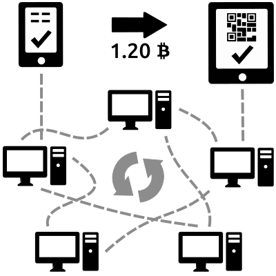
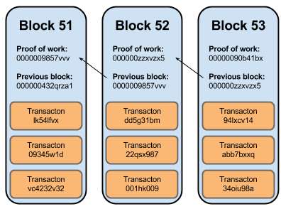

title: Blockchain Introduction
author:
  name: Blain Maguire
  twitter: blainmaguire
  url: http://blainmaguire.com
theme: sjaakvandenberg/cleaver-dark
output: blockchain.html
--

### Blockchain Introduction

---
### Overview:

* What is a Blockchain?
* Properties of Blockchains
* What's in a block?
* Proof of Work
* Verifying the chain
* Recent Implementations
* Why Blockchain?
* Who's using it?
* Build your own

--
### What is a Blockchain?

A blockchain is essentially just a record of digital events — one that’s “distributed” or shared between many different parties.

This record is a distributed database over a peer to peer network which is constantly growing.

--
### Bitcoin's Blockchain:

The record is a public ledger on which the entire Bitcoin network relies.

It has all confirmed transactions that ever happened on the network.

E.g. <small>*<a>Alice</a>* paid *<a>Bob</a>* 4.2Ƀ at _13:37 26-04-2016_</small>
--

### Properties of a Blockchain

* Events are recorded in chronological order into 'Blocks'
* Records signed digitally, using public key cryptography
* Only can added to by updated by consensus
--

### Bitcoin's Blockchain Properties:

* Transactions are events, batched into blocks
* No personal data is needed, only cryptographic keys
* Transfer happens by digitally signing transactions with private key
* Once confirmed, bitcoin transactions are irreversible
--

### Blockchain Operations

* Most operations will be clients reading (and verifying new blocks)
* Once a block is added and confirmed, that's it.
* Adding a new block requires:
	* proving authenicity via public key cryptography
	* proof of work

--

### What's in a block?

Each new block contains:

* A timestamp of when it was created along with proof of work
* Data to be recorded (in bitcoins' case batch of transactions)
* A link to the previous block via cryptographic hash (hence 'chain')

--

### Proof of Work

One way functions (e.g. cryptographic hashes like SHA256)
Computationally cheap to verify.

Expensive to get the input back from output

Computationally expensive limits the number of new blocks

--

### Verifying the Chain

Not relying on timestamp itself or any numerical sequence for order

Instead, verify our one way function.

--
### Verifying the Chain

--
### Verifying the Chain

In event multiple block 52s announced, network prefers longest valid chain after 52.

More computationally expensive to get ahead of network than to generate new blocks honestly.

--
### Recent Blockchain Implementations

* Data is not just a record of what happened, but actual programs
* Results of execution also can be stored in blocks
* Adding this ability allows for 'smart contracts'

--
### Recent Blockchain Implementations

*Smart Contracts*

* decentralized network confirms that a contract of any kind was executed properly

* doesn't reveal any confidential information about the parties or the transaction

--
### Recent Blockchain Implementations

Because of this, not only can we extend bitcoin, we can create a variety of services on top of the blockchain.

Think DNS, HTTP, reddit/twitter/facebook, etc

--
### Why Blockchain?

Permissionless - no 'trusted party' required in order to participate

Decentralisation - no single point of failure in the system

Privacy - pseudonymous, no need to disclose personal information to authenicate/verify
--
### Who's using it?

Bank Of Ireland - successful trail April 16

Eestipank (Bank of Estonia, estonia has lowest card fraud rate in Eurozone)
--
### Build your own

Ethereum (ethereum.org) is a good start

The startup has written a web app and programming language to define contracts (open source)
